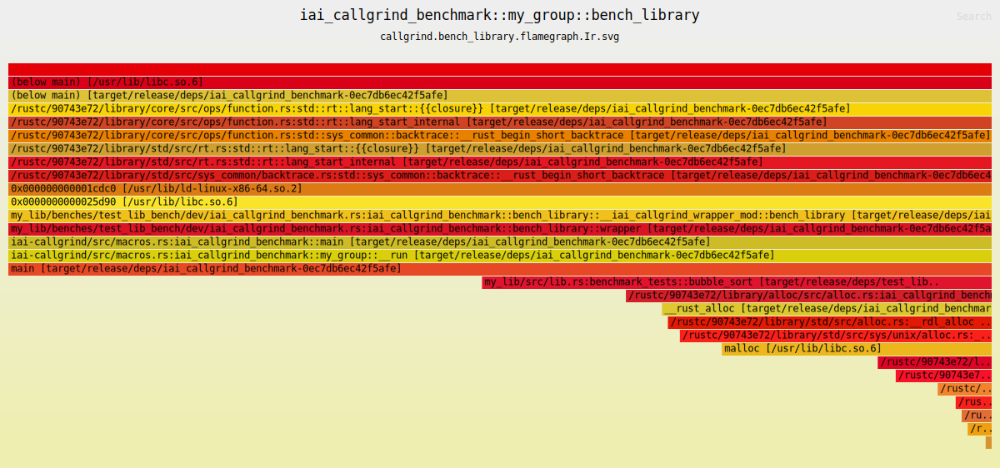
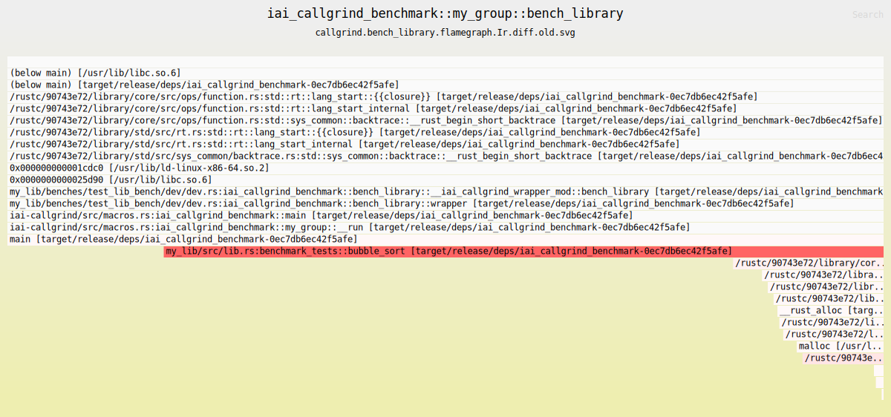

# Callgrind Flamegraphs

Flamegraphs are opt-in and can be created if you pass a `FlamegraphConfig` to
the `BinaryBenchmarkConfig` or `LibraryBenchmarkConfig`. Callgrind flamegraphs
are meant as a complement to valgrind's visualization tools
`callgrind_annotate` and `kcachegrind`.

For example create all kind of flamegraphs for all benchmarks in a library
benchmark:

```rust
# extern crate iai_callgrind;
# mod my_lib { pub fn bubble_sort(_: Vec<i32>) -> Vec<i32> { vec![] } }
use iai_callgrind::{
    library_benchmark, library_benchmark_group, main, LibraryBenchmarkConfig,
    FlamegraphConfig
};
use std::hint::black_box;

#[library_benchmark]
fn bench_library() -> Vec<i32> {
    black_box(my_lib::bubble_sort(vec![3, 2, 1]))
}

library_benchmark_group!(name = my_group; benchmarks = bench_library);

# fn main() {
main!(
    config = LibraryBenchmarkConfig::default()
        .flamegraph(FlamegraphConfig::default());
    library_benchmark_groups = my_group
);
# }
```

The produced flamegraph `*.svg` files are located next to the respective
callgrind output file in the `target/iai`
[directory](./cli_and_env/output/out_directory.md).

## Regular Flamegraphs

Regular callgrind flamegraphs show the inclusive costs for functions and a
single `EventKind` (default is `EventKind::Ir`), similar to
`callgrind_annotate`. Suppose the example from above is stored in a benchmark
`iai_callgrind_benchmark`:



If you open this image in a new tab, you can play around with the svg.

## Differential Flamegraphs

Differential flamegraphs facilitate a deeper understanding of code sections
which cause a bottleneck or a performance regressions etc.



We simulated a small change in `bubble_sort` and in the differential flamegraph
you can spot fairly easily where the increase of `Instructions` is happening.

## (Experimental) Create flamegraphs for multi-threaded/multi-process benchmarks

Note the following only affects flamegraphs of multi-threaded/multi-process
benchmarks and benchmarks which produce multiple parts with a total over all
sub-metrics.

Currently, Iai-Callgrind creates the flamegraphs only for the total over all
threads/parts and subprocesses. This leads to complications since the call graph
is not be fully recovered just by examining each thread/subprocess separately.
So, the total metrics in the flamegraphs might not be the same as the total
metrics shown in the terminal output. If in doubt, the terminal output shows the
the correct metrics.
